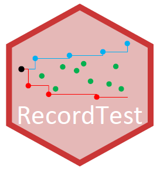

RecordTest 
======================

[](https://CRAN.R-project.org/package=RecordTest)
[](https://cran.r-project.org/web/checks/check_results_RecordTest.html)
[](https://CRAN.R-project.org/package=RecordTest)
[](https://CRAN.R-project.org/package=RecordTest)
[](https://www.gnu.org/licenses/gpl-3.0.en.html)
  
The R package *RecordTest* provides exploratory data analysis and inference tools based on theory of records to describe the record occurrence and detect trends and change-points in time series. In particular, *RecordTest* consists of graphical tools, distribution-free tests for trend in location, variation or non-stationarity in the tails, and change-point detection tests, all of them based on the record occurrence. 
  
  
## Installation
You can install the **stable** version from
[CRAN](https://CRAN.R-project.org/package=RecordTest).

```s
install.packages("RecordTest")
```

You can install the **development** version from
[GitHub](https://github.com/JorgeCastilloMateo/RecordTest)

```s
# install.packages("remotes")
remotes::install_github("JorgeCastilloMateo/RecordTest")
```

## How to start?
Get started in *RecordTest* with the vignettes

```s
vignette("RecordTest")
```

## How to cite?
Castillo-Mateo J (2022).
“RecordTest: Inference Tools in Time Series Based on Record Statistics.”
R package version 2.1.1. 
https://CRAN.R-project.org/package=RecordTest

  
## References
Castillo-Mateo J (2022).
“Distribution-Free Changepoint Detection Tests Based on the Breaking of Records.”
*Environmental and Ecological Statistics*, **29**(3), 655-676. 
<doi:10.1007/s10651-022-00539-2>

Cebrián AC, Castillo-Mateo J, Asín J (2022).
“Record Tests to Detect Non Stationarity in the Tails with an Application to Climate Change.”
*Stochastic Environmental Research and Risk Assessment*, **36**(2): 313-330. 
<doi:10.1007/s00477-021-02122-w>

Diersen J, Trenkler G (1996). “Records Tests for Trend in Location.”
*Statistics*, **28**(1), 1-12.
<doi:10.1080/02331889708802543>

Foster FG, Stuart A (1954). 
“Distribution-Free Tests in Time-Series Based on the Breaking of Records.”
*Journal of the Royal Statistical Society. Series B (Methodological)*, 
**16**(1), 1-22.
