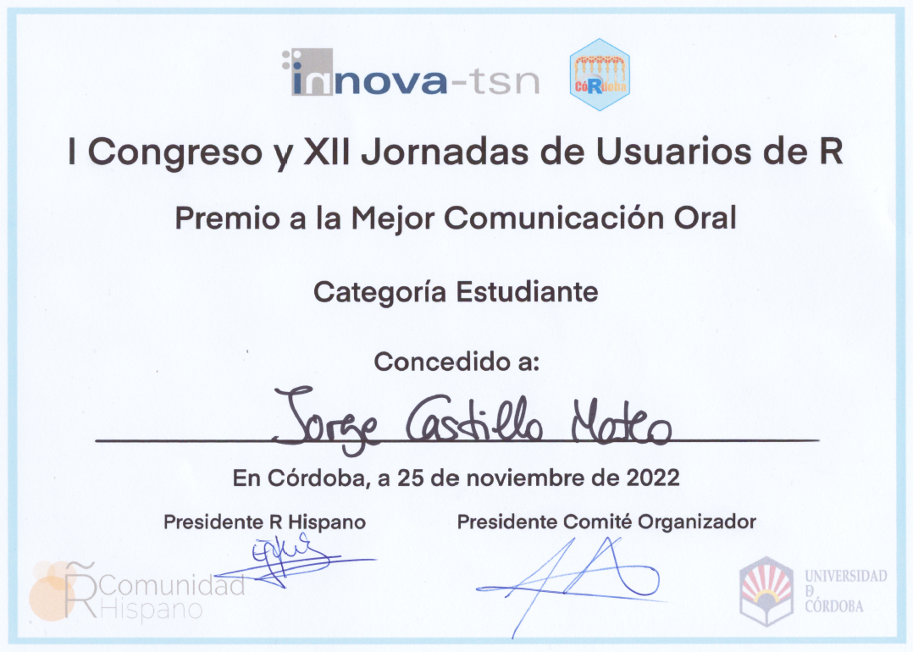

RecordTest 
======================

[](https://CRAN.R-project.org/package=RecordTest)
[](https://cran.r-project.org/web/checks/check_results_RecordTest.html)
[](https://CRAN.R-project.org/package=RecordTest)
[](https://CRAN.R-project.org/package=RecordTest)
[](https://www.gnu.org/licenses/gpl-3.0.en.html)
  
The R package *RecordTest* provides exploratory data analysis and inference tools based on theory of records to describe the record occurrence and detect trends and change-points in time series. In particular, *RecordTest* consists of graphical tools, distribution-free tests for trend in location, variation or non-stationarity in the tails, and change-point detection tests, all of them based on the record occurrence. Details about the implemented tools can be found in Castillo-Mateo et al. (2023a) <doi:10.18637/jss.v106.i05> and Castillo-Mateo et al. (2023b) <doi:10.1016/j.atmosres.2023.106934>.
  
  
## Installation
You can install the **stable** version from
[CRAN](https://CRAN.R-project.org/package=RecordTest).

```s
install.packages("RecordTest")
```

You can install the **development** version from
[GitHub](https://github.com/JorgeCastilloMateo/RecordTest)

```s
if (!require("remotes")) install.packages("remotes")
remotes::install_github("JorgeCastilloMateo/RecordTest")
```

## How to start?
Get started in *RecordTest* with the vignettes

```s
vignette("RecordTest")
```


## How to cite?
To cite *RecordTest* in publications use:

Castillo-Mateo J, Cebrián AC, Asín J (2023).
“RecordTest: An R Package to Analyze Non-Stationarity in the Extremes Based on Record-Breaking Events.”
*Journal of Statistical Software*, **106**(5), 1--28.
<doi:10.18637/jss.v106.i05>.

A BibTeX entry for LaTeX users is

@Article{,  
&nbsp;&nbsp;  title = {{RecordTest}: An {R} Package to Analyze Non-Stationarity in the Extremes Based on Record-Breaking Events},  
&nbsp;&nbsp;  author = {Jorge Castillo-Mateo and Ana C. Cebri\\\'an and Jes\\\'us As{\\\'\\i}n},  
&nbsp;&nbsp;  journal = {Journal of Statistical Software},  
&nbsp;&nbsp;  year = {2023},  
&nbsp;&nbsp;  volume = {106},  
&nbsp;&nbsp;  number = {5},  
&nbsp;&nbsp;  pages = {1--28},  
&nbsp;&nbsp;  doi = {10.18637/jss.v106.i05},  
}


## Award winner

Best Oral Communication Award (Student Category) of the I Conference \& XII Meeting of R users. I Congreso \& XII Jornadas de usuarios de R, Córdoba, Spain.



  
## References
Castillo-Mateo J (2022).
“Distribution-Free Changepoint Detection Tests Based on the Breaking of Records.”
*Environmental and Ecological Statistics*, **29**(3), 655--676. 
<doi:10.1007/s10651-022-00539-2>.

Castillo-Mateo J, Cebrián AC, Asín J (2023a).
“RecordTest: An R Package to Analyze Non-Stationarity in the Extremes Based on Record-Breaking Events.”
*Journal of Statistical Software*, **106**(5), 1--28.
<doi:10.18637/jss.v106.i05>.

Castillo-Mateo J, Cebrián AC, Asín J (2023b).
“Statistical Analysis of Extreme and Record-Breaking Daily Maximum Temperatures in Peninsular Spain during 1960--2021.”
*Atmospheric Research*, **293**, 106934.
<doi:10.1016/j.atmosres.2023.106934>.

Cebrián AC, Castillo-Mateo J, Asín J (2022).
“Record Tests to Detect Non Stationarity in the Tails with an Application to Climate Change.”
*Stochastic Environmental Research and Risk Assessment*, **36**(2), 313--330. 
<doi:10.1007/s00477-021-02122-w>.

Diersen J, Trenkler G (1996). 
“Records Tests for Trend in Location.”
*Statistics*, **28**(1), 1--12.
<doi:10.1080/02331889708802543>.

Foster FG, Stuart A (1954). 
“Distribution-Free Tests in Time-Series Based on the Breaking of Records.”
*Journal of the Royal Statistical Society B*, **16**(1), 1--22.
<doi:10.1111/j.2517-6161.1954.tb00143.x>.
